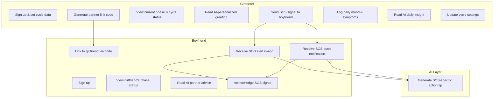
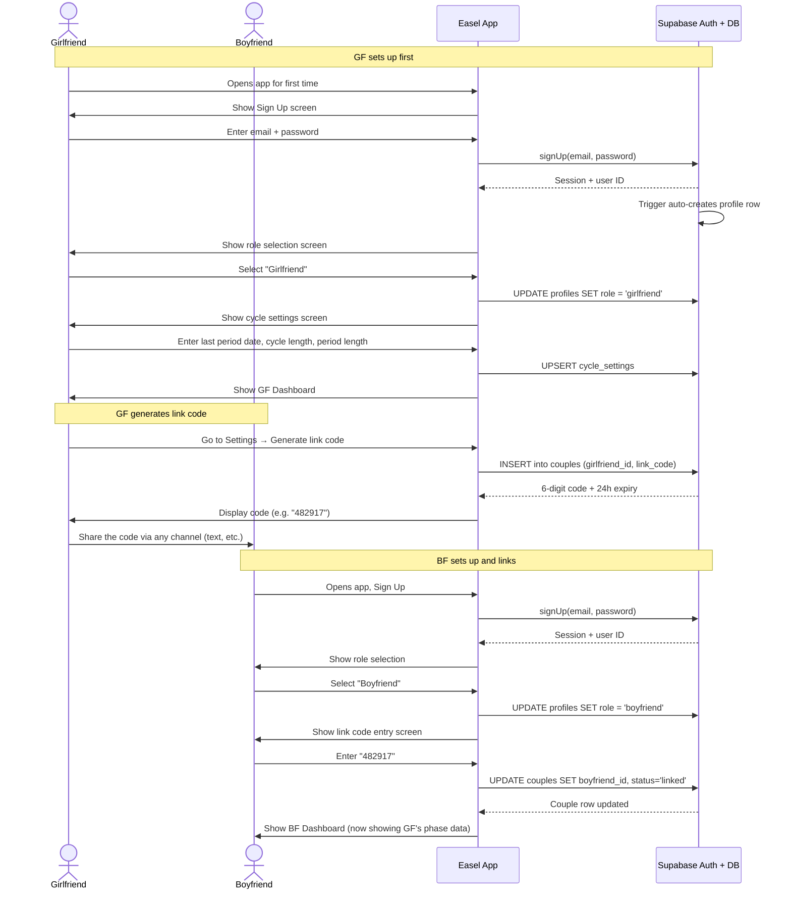
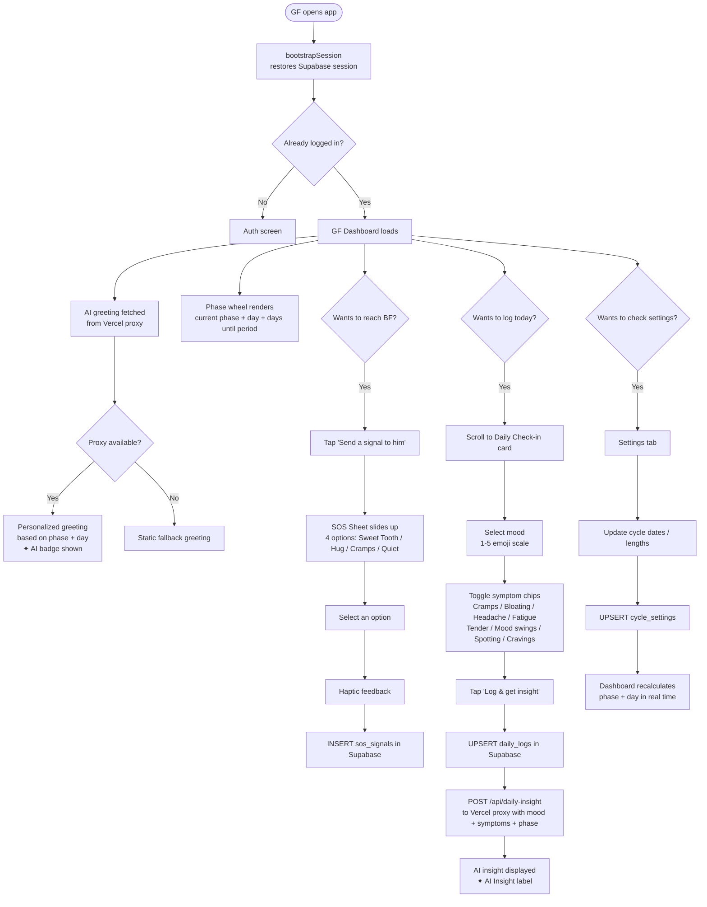
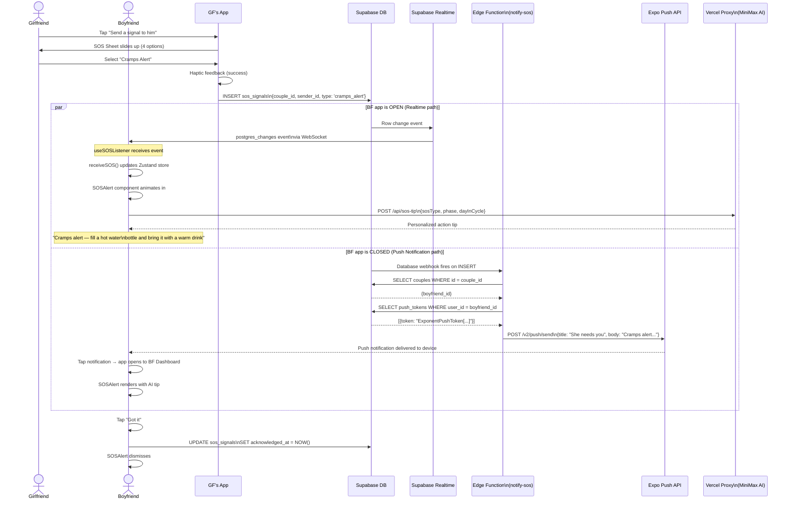
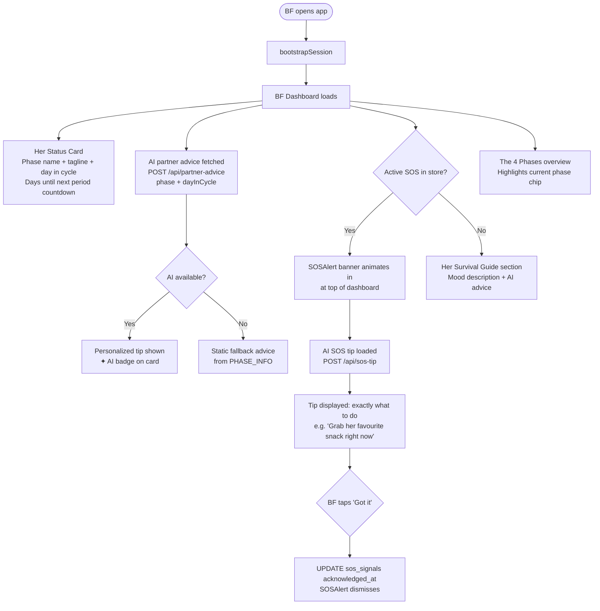
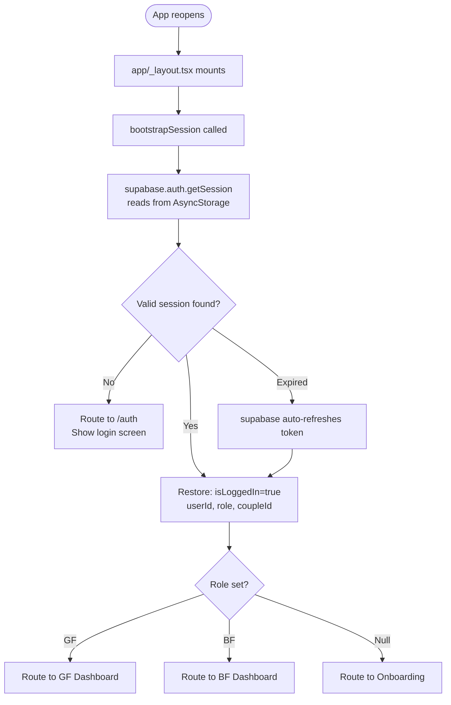
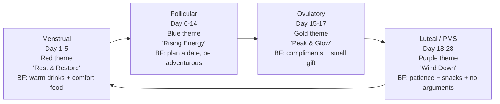
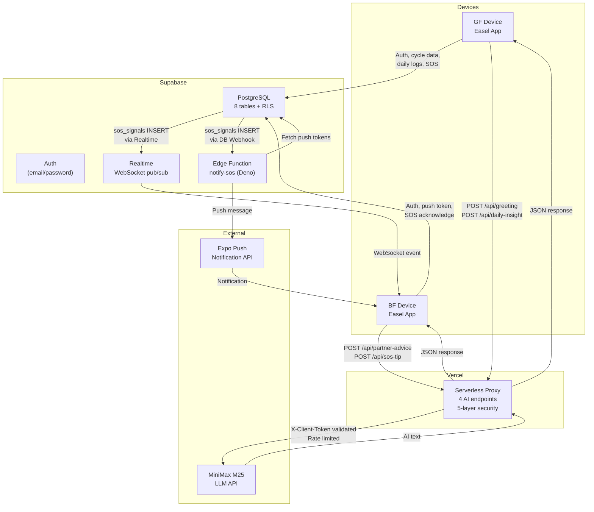

# Easel — Customer Journeys & Use Cases

Easel is a couples period tracking app. Two people share one experience: the **Girlfriend (GF)** tracks her cycle and wellbeing; the **Boyfriend (BF)** receives context-aware guidance on how to support her. All data is private to the couple — no one else can read it.

---

## Actors

| Actor | Who they are | What they want |
|---|---|---|
| **Girlfriend (GF)** | The person tracking their menstrual cycle | Understand her cycle, log how she feels daily, reach her partner when she needs support |
| **Boyfriend (BF)** | The partner | Understand what she's going through, know what to do, be notified when she needs him |
| **AI (MiniMax M25)** | The AI layer via Vercel proxy | Personalize greetings, advice, and insights based on cycle phase and logged data |
| **Supabase Realtime** | Infrastructure | Deliver in-app SOS alerts instantly to BF without polling |
| **Expo Push API** | Infrastructure | Deliver SOS notifications to BF's device when the app is closed |

---

## Use Case Map

---

## Journey 1 — First-Time Setup (Both Users)

Both users go through this once before anything else works.

---

## Journey 2 — Girlfriend's Daily Loop

What GF does every day.

---

## Journey 3 — SOS Signal Flow (Full)

The most time-critical path in the app. GF needs BF immediately.

---

## Journey 4 — Boyfriend's Daily Loop

What BF sees and does when he opens the app.

---

## Journey 5 — Returning User (Session Restore)

What happens when either user reopens the app after closing it.

---

## Journey 6 — Cycle Phase Transitions Over a 28-Day Cycle

How GF's experience changes automatically as her cycle progresses.

```mermaid
gantt
    title 28-Day Cycle — Phase Timeline
    dateFormat  D
    axisFormat  Day %d

    section Phases
    Menstrual (Rest & Restore)     :done,    m, 1, 5d
    Follicular (Rising Energy)     :active,  f, 6, 9d
    Ovulatory (Peak & Glow)        :         o, 15, 3d
    Luteal / PMS (Wind Down)       :crit,    l, 18, 11d
```

Each phase change:
- Updates the **color theme** across both dashboards
- Changes the **AI greeting** for GF (different tone, different energy)
- Changes the **AI partner advice** for BF (phase-specific actions)
- Updates the **self-care tip** shown to GF
- Recalculates **days until next period** countdown

---

## Use Case Summary Table

| # | Use Case | Actor | Trigger | System Response |
|---|---|---|---|---|
| UC1 | Sign up | GF / BF | Open app first time | Create auth user + profile row in Supabase |
| UC2 | Set cycle data | GF | Onboarding / Settings | UPSERT `cycle_settings`; dashboard recalculates |
| UC3 | Generate link code | GF | Settings tap | INSERT `couples` row; display 6-digit code |
| UC4 | Link to partner | BF | Enter code in onboarding | UPDATE `couples` with `boyfriend_id`; status → `linked` |
| UC5 | View phase dashboard | GF | Open app | Calculate phase from cycle settings; render phase wheel |
| UC6 | View partner status | BF | Open app | Read GF's `cycle_settings` via RLS-allowed query |
| UC7 | Get AI greeting | GF | Dashboard loads | Fetch `POST /api/greeting` with phase + day |
| UC8 | Get AI partner advice | BF | Dashboard loads | Fetch `POST /api/partner-advice` with phase + day |
| UC9 | Send SOS signal | GF | Tap signal button → pick type | INSERT `sos_signals`; triggers Realtime + webhook |
| UC10 | Receive SOS (in-app) | BF | App is open | Realtime WebSocket delivers event; SOSAlert renders |
| UC11 | Receive SOS (background) | BF | App is closed | Edge Function → Expo Push → device notification |
| UC12 | Get AI SOS tip | BF | SOS alert received | Fetch `POST /api/sos-tip` with SOS type + phase |
| UC13 | Acknowledge SOS | BF | Tap "Got it" | UPDATE `sos_signals.acknowledged_at`; alert dismisses |
| UC14 | Log daily check-in | GF | Scroll to check-in card | Select mood + symptoms; tap submit |
| UC15 | Get AI daily insight | GF | After submitting check-in | UPSERT `daily_logs`; fetch `POST /api/daily-insight` |
| UC16 | Update cycle settings | GF | Settings tab | UPSERT `cycle_settings`; phase recalculates instantly |
| UC17 | Sign out | GF / BF | Settings tap | `supabase.auth.signOut()`; clear Zustand; route to auth |
| UC18 | Session restore | GF / BF | Reopen app | `bootstrapSession` reads AsyncStorage; no re-login needed |

---

## Data Flow Architecture

---

## Edge Cases & Boundary Conditions

| Scenario | Behavior |
|---|---|
| BF has no account yet when GF generates code | Code stays valid for 24h; BF can link any time within that window |
| Link code expires (>24h) | GF regenerates from Settings; old code is replaced |
| GF sends SOS, BF has no push token | Realtime still works when app is open; no push when closed (silent fail, no error to GF) |
| GF sends multiple SOS signals quickly | Each INSERT triggers Realtime + Edge Function; BF sees the latest one |
| Proxy is down / MiniMax API fails | Static fallback text shown immediately; `isAI` flag stays false; no error shown to user |
| User reopens app with expired JWT | Supabase SDK auto-refreshes token from AsyncStorage; seamless re-entry |
| Two GFs try to link to same BF | RLS + `UNIQUE (girlfriend_id)` constraint prevents one GF from being in two couples |
| Daily check-in submitted twice on same day | `UPSERT` with `ON CONFLICT (user_id, log_date)` — updates existing row silently |
