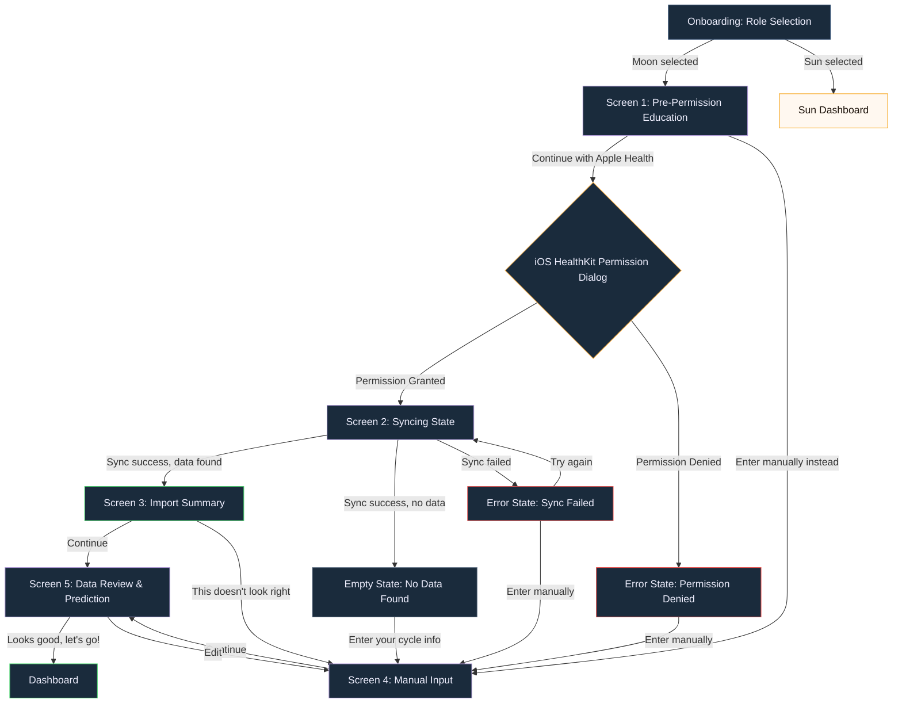

# UI Design Specification: iOS Health Sync + Period Prediction Onboarding

**Version:** 1.0
**Date:** 2026-03-08
**Status:** Draft
**Feature:** iOS HealthKit Sync Enhancement + Guided Period Prediction Onboarding
**Related PRD:** `docs/PRD_ios_health_sync_period_prediction.md`

---

## Design System Reference

All screens in this flow use the **Moon theme** (dark indigo), regardless of the user having just selected the Moon role. The Moon theme creates a calming, intimate atmosphere appropriate for entering sensitive health data.

### Token Reference (from `constants/theme.ts`)

| Token | Value | Usage |
|-------|-------|-------|
| `MoonColors.background` | `#0D1B2A` | Screen background |
| `MoonColors.surface` | `#1A2B3C` | Card backgrounds |
| `MoonColors.accentPrimary` | `#B39DDB` | Primary buttons, accent elements |
| `MoonColors.accentSecondary` | `#E0E0F0` | Secondary accent |
| `MoonColors.textPrimary` | `#F0F0FF` | Headlines, primary text |
| `MoonColors.textSecondary` | `#A8BAC8` | Body text, descriptions |
| `MoonColors.textHint` | `#6B7A8C` | Hint text, secondary actions |
| `MoonColors.card` | `#162233` | Card/surface elements |
| `MoonColors.inputBg` | `#1E3045` | Form field backgrounds |
| `MoonColors.border` | `#2D4A6B` | Borders, dividers |
| `SharedColors.success` | `#4CAF50` | Success states |
| `SharedColors.error` | `#EF5350` | Error states, validation |
| `SharedColors.warning` | `#FFB347` | Warning/medium confidence |
| `SharedColors.info` | `#42A5F5` | Info states |
| `Colors.menstrual` | `#FF5F7E` | Period-related highlights |
| `Colors.luteal` | `#4AD66D` | Success icon alternative |
| `Typography.displayBold` | `fontSize: 32, fontWeight: '700'` | Screen headlines |
| `Typography.titleBold` | `fontSize: 24, fontWeight: '700'` | Section titles |
| `Typography.headlineBold` | `fontSize: 19, fontWeight: '700'` | Card titles |
| `Typography.body` | `fontSize: 16, fontWeight: '400'` | Body text |
| `Typography.bodyBold` | `fontSize: 16, fontWeight: '700'` | Emphasized body |
| `Typography.caption` | `fontSize: 13, fontWeight: '500'` | Captions, labels |
| `Typography.tiny` | `fontSize: 11, fontWeight: '600'` | Privacy notes, badges |
| `Spacing.sm` | `8` | Tight spacing |
| `Spacing.md` | `16` | Standard spacing |
| `Spacing.lg` | `24` | Section spacing |
| `Spacing.xl` | `32` | Large gaps |
| `Spacing.xxl` | `48` | Major section breaks |
| `Radii.sm` | `12` | Cards, inputs |
| `Radii.md` | `20` | Medium elements |
| `Radii.lg` | `28` | Buttons |
| `Radii.full` | `9999` | Circles, pills |

---

## 1. Screen Flow Diagram



### Flow Entry Point

The flow is entered from `onboarding.tsx` when the user selects the **Moon** role. The existing `handleSelectRole('moon')` call currently routes to `/health-sync`. The new flow replaces this single screen with a multi-step onboarding sequence.

### Navigation Strategy

All screens in this flow are **full-screen modals** using Expo Router's stack navigation. The user cannot go back to role selection once they enter the health sync flow (consistent with current behavior). Within the flow, hardware back button and swipe-back are disabled to prevent data loss; only explicit UI buttons navigate between screens.

---

## 2. Screen 1: Pre-Permission Education

**Route:** `/health-sync/education`
**Purpose:** Build trust and explain HealthKit access before the system dialog appears.

### Layout Structure

```
SafeAreaView (flex: 1, bg: #0D1B2A, paddingHorizontal: 32)
├── Spacer (flex: 1)
├── Hero Illustration Container
│   └── Icon composition (moon + heart + health)
├── Gap (32px)
├── Headline Text
├── Gap (16px)
├── Body Text
├── Gap (24px)
├── Bullet Point List
│   ├── Bullet 1 (checkmark + text)
│   ├── Bullet 2 (checkmark + text)
│   └── Bullet 3 (checkmark + text)
├── Gap (48px)
├── Primary CTA Button
├── Gap (12px)
├── Secondary Text Button
├── Spacer (flex: 1)
└── Privacy Badge Row
```

### Component Specifications

#### Hero Illustration Container

| Property | Value |
|----------|-------|
| Width | 200px |
| Height | 200px |
| Border radius | 100px (circle) |
| Background | `MoonColors.accentPrimary + '12'` (7% opacity) |
| Border | 1px solid `MoonColors.accentPrimary + '30'` (19% opacity) |
| Alignment | Centered horizontally |

**Inner icons (layered):**
- Background layer: Feather `heart` icon, size 80, color `MoonColors.accentPrimary + '25'` (positioned center)
- Foreground layer: Feather `moon` icon, size 48, color `MoonColors.accentPrimary` (positioned center-left, offset -16px)
- Foreground layer: Feather `activity` icon, size 36, color `Colors.menstrual` (positioned center-right, offset +16px)

#### Headline

| Property | Value |
|----------|-------|
| Text | "Sync your cycle data" |
| Style | `Typography.displayBold` (fontSize: 32, fontWeight: '700') |
| Color | `MoonColors.textPrimary` (#F0F0FF) |
| Text align | Center |
| Letter spacing | -0.5 |
| Line height | 40 |

#### Body Text

| Property | Value |
|----------|-------|
| Text | "Connect Apple Health to import your period history. This helps us give you accurate predictions from day one." |
| Style | `Typography.body` (fontSize: 16, fontWeight: '400') |
| Color | `MoonColors.textSecondary` (#A8BAC8) |
| Text align | Center |
| Line height | 24 |
| Max width | 320px |

#### Bullet Point List

Container: vertical stack, gap 16px, paddingHorizontal: 8, alignSelf: 'stretch'

Each bullet row:

| Property | Value |
|----------|-------|
| Layout | Row, alignItems: 'center', gap: 12px |
| Icon container | 28x28px circle, bg `MoonColors.accentPrimary + '18'`, centered |
| Icon | Feather `check`, size 14, color `MoonColors.accentPrimary` |
| Text | `Typography.body`, color `MoonColors.textPrimary` |

Bullet items:
1. "Period dates and cycle length"
2. "Read-only access — we never write to Health"
3. "Your data stays private and encrypted"

#### Primary CTA Button

| Property | Value |
|----------|-------|
| Text | "Continue with Apple Health" |
| Height | 60px |
| Width | 100% |
| Background | `MoonColors.accentPrimary` (#B39DDB) |
| Border radius | 30px (`Radii.lg + 2`) |
| Text style | fontSize: 16, fontWeight: '700' |
| Text color | `#FFFFFF` |
| Active opacity | 0.85 |
| Icon | Feather `heart` size 18, color white, positioned left of text with 8px gap |
| Shadow | `{ color: MoonColors.accentPrimary, offset: { width: 0, height: 4 }, opacity: 0.3, radius: 12 }` |
| Haptic | `Haptics.impactAsync(ImpactFeedbackStyle.Medium)` on press |
| Min touch target | 44x60pt |

#### Secondary Text Button

| Property | Value |
|----------|-------|
| Text | "Enter manually instead" |
| Style | fontSize: 16, fontWeight: '400' |
| Color | `MoonColors.textHint` (#6B7A8C) |
| Text decoration | Underline |
| Padding | 12px vertical (for touch target) |
| Min touch target | 44x44pt |

#### Privacy Badge

| Property | Value |
|----------|-------|
| Layout | Row, alignItems: 'center', gap: 4px, paddingBottom: 8 |
| Icon | Feather `shield`, size 12, color `MoonColors.textHint` |
| Text | "Protected by Apple HealthKit encryption" |
| Text style | `Typography.tiny` (fontSize: 11, fontWeight: '600') |
| Text color | `MoonColors.textHint` (#6B7A8C) |

### Accessibility

- VoiceOver reading order: Headline -> Body -> Bullet 1 -> Bullet 2 -> Bullet 3 -> Primary CTA -> Secondary CTA -> Privacy badge
- Primary CTA: `accessibilityRole="button"`, `accessibilityLabel="Continue with Apple Health. Tap to grant health data access."`
- Secondary CTA: `accessibilityRole="button"`, `accessibilityLabel="Enter manually instead. Skip Apple Health sync."`
- Hero illustration: `accessibilityLabel="Moon and health sync illustration"`, `accessibilityRole="image"`

---

## 3. Screen 2: Syncing State

**Route:** Inline state within the education screen (no separate route)
**Purpose:** Provide visual feedback during HealthKit data fetch.
**Duration:** Typically 1-3 seconds, max 5 seconds before timeout.

### Layout Structure

```
SafeAreaView (flex: 1, bg: #0D1B2A, justifyContent: center, alignItems: center)
├── Animated Ring Container
│   └── Progress Ring (animated)
│   └── Moon Icon (centered)
├── Gap (32px)
├── Status Text
├── Gap (8px)
└── Substatus Text
```

### Component Specifications

#### Animated Ring Container

| Property | Value |
|----------|-------|
| Width | 120px |
| Height | 120px |
| Alignment | Centered |

**Progress Ring:**
- Outer ring: 120x120px, strokeWidth: 3, color `MoonColors.accentPrimary + '30'`
- Animated arc: strokeWidth: 3, color `MoonColors.accentPrimary`, animated rotation (1.5s per revolution, `Easing.linear`, loop)
- Implementation: `react-native-reanimated` with `useSharedValue` and `withRepeat(withTiming(...))`

**Center Icon:**
- Feather `moon`, size 40, color `MoonColors.accentPrimary`
- Subtle pulse animation: scale 1.0 -> 1.08 -> 1.0, duration 2s, `Easing.inOut(Easing.ease)`, loop

#### Status Text

| Property | Value |
|----------|-------|
| Text | "Syncing your cycle data..." |
| Style | `Typography.titleBold` (fontSize: 24, fontWeight: '700') |
| Color | `MoonColors.textPrimary` (#F0F0FF) |
| Text align | Center |

#### Substatus Text

| Property | Value |
|----------|-------|
| Text | "Reading from Apple Health" |
| Style | `Typography.body` (fontSize: 16, fontWeight: '400') |
| Color | `MoonColors.textSecondary` (#A8BAC8) |
| Text align | Center |

**Three-dot loading indicator** appended to substatus text:
- Three dots that animate opacity sequentially: dot 1 -> dot 2 -> dot 3 -> repeat
- Each dot: 4px circle, color `MoonColors.textSecondary`
- Stagger delay: 300ms between each dot
- Implementation: `react-native-reanimated` `withDelay` + `withRepeat(withSequence(...))`

### Transition Animations

- **Entry:** Fade in from education screen (opacity 0 -> 1, duration 300ms, `Easing.out(Easing.ease)`)
- **Exit to Import Summary:** Ring fills to complete circle, checkmark replaces moon icon (200ms), then crossfade to next screen (300ms)
- **Exit to Error/Empty:** Ring stops, icon fades, then crossfade (300ms)

---

## 4. Screen 3: Import Summary

**Route:** `/health-sync/summary`
**Purpose:** Confirm what HealthKit data was imported before proceeding.

### Layout Structure

```
SafeAreaView (flex: 1, bg: #0D1B2A, paddingHorizontal: 32)
├── Spacer (flex: 0.5)
├── Success Icon
├── Gap (24px)
├── Headline
├── Gap (8px)
├── Subheadline
├── Gap (32px)
├── Stats Card Row
│   ├── Stat Card 1: Periods Found
│   ├── Stat Card 2: Date Range
│   └── Stat Card 3: Avg Cycle Length
├── Gap (48px)
├── Primary CTA Button
├── Gap (12px)
├── Secondary Text Button
└── Spacer (flex: 1)
```

### Component Specifications

#### Success Icon

| Property | Value |
|----------|-------|
| Container | 80x80px circle |
| Background | `SharedColors.success + '18'` (7% opacity of #4CAF50) |
| Border | 2px solid `SharedColors.success + '40'` |
| Icon | Feather `check-circle`, size 40, color `SharedColors.success` |
| Alignment | Centered |
| Entry animation | Scale from 0 -> 1 with spring (damping: 12, stiffness: 120), 400ms delay after screen mount |

#### Headline

| Property | Value |
|----------|-------|
| Text | "We found your data" |
| Style | `Typography.displayBold` (fontSize: 32, fontWeight: '700') |
| Color | `MoonColors.textPrimary` |
| Text align | Center |
| Letter spacing | -0.5 |

#### Subheadline

| Property | Value |
|----------|-------|
| Text | "Here's what we imported from Apple Health" |
| Style | `Typography.body` |
| Color | `MoonColors.textSecondary` |
| Text align | Center |

#### Stats Card Row

Layout: horizontal row with gap 12px, alignSelf: 'stretch'. Each card flexes equally (`flex: 1`).

**Individual Stat Card:**

| Property | Value |
|----------|-------|
| Background | `MoonColors.card` (#162233) |
| Border | 1px solid `MoonColors.border` (#2D4A6B) |
| Border radius | `Radii.sm` (12px) |
| Padding | 16px |
| Alignment | Center |
| Min height | 100px |

Card internal layout:

```
VStack (alignItems: center, gap: 8px)
├── Value Text (large number or date range)
└── Label Text (description)
```

**Card 1: Periods Found**
| Element | Value |
|---------|-------|
| Value | Dynamic (e.g., "12") |
| Value style | fontSize: 28, fontWeight: '700', color: `Colors.menstrual` (#FF5F7E) |
| Label | "periods" |
| Label style | `Typography.caption`, color: `MoonColors.textSecondary` |

**Card 2: Date Range**
| Element | Value |
|---------|-------|
| Value | Dynamic (e.g., "14 mo") |
| Value style | fontSize: 28, fontWeight: '700', color: `MoonColors.accentPrimary` |
| Label | "of history" |
| Label style | `Typography.caption`, color: `MoonColors.textSecondary` |

**Card 3: Average Cycle Length**
| Element | Value |
|---------|-------|
| Value | Dynamic (e.g., "29d") |
| Value style | fontSize: 28, fontWeight: '700', color: `Colors.follicular` (#70D6FF) |
| Label | "avg cycle" |
| Label style | `Typography.caption`, color: `MoonColors.textSecondary` |

Card entry animation: stagger from left to right, each card slides up (translateY: 20 -> 0) + fades in (opacity 0 -> 1), 100ms stagger, 300ms duration, `Easing.out(Easing.ease)`.

#### Primary CTA Button

| Property | Value |
|----------|-------|
| Text | "Continue" |
| Style | Same as Screen 1 primary button |
| Icon | Feather `arrow-right`, size 18, white, right of text |

#### Secondary Text Button

| Property | Value |
|----------|-------|
| Text | "This doesn't look right" |
| Style | fontSize: 16, fontWeight: '400', color: `MoonColors.textHint`, underline |
| Padding | 12px vertical |
| Action | Navigate to Manual Input (Screen 4) with HealthKit values pre-filled |

---

## 5. Screen 4: Manual Input

**Route:** `/health-sync/manual-input`
**Purpose:** Allow users to enter cycle data manually when HealthKit is unavailable, denied, or inaccurate.

### Layout Structure

```
SafeAreaView (flex: 1, bg: #0D1B2A)
├── ScrollView (paddingHorizontal: 24)
│   ├── Gap (24px)
│   ├── Headline
│   ├── Gap (8px)
│   ├── Subheadline
│   ├── Gap (32px)
│   ├── Date Picker Card
│   │   ├── Label
│   │   ├── Date Display / Picker
│   │   └── Validation Message (conditional)
│   ├── Gap (24px)
│   ├── Cycle Length Slider Card
│   │   ├── Label + Value Display
│   │   ├── Slider
│   │   └── Range Labels
│   ├── Gap (24px)
│   ├── Period Length Slider Card
│   │   ├── Label + Value Display
│   │   ├── Slider
│   │   └── Range Labels
│   ├── Gap (16px)
│   ├── "I'm not sure" Toggle Row
│   ├── Gap (24px)
│   └── Live Prediction Preview Card
├── Bottom Fixed Container (paddingHorizontal: 24, paddingBottom: safe area)
│   └── Primary CTA Button
```

### Component Specifications

#### Headline

| Property | Value |
|----------|-------|
| Text | "Tell us about your cycle" |
| Style | `Typography.displayBold` |
| Color | `MoonColors.textPrimary` |
| Letter spacing | -0.5 |

#### Subheadline

| Property | Value |
|----------|-------|
| Text | "This helps us predict your next period accurately" |
| Style | `Typography.body` |
| Color | `MoonColors.textSecondary` |
| Line height | 24 |

#### Date Picker Card

| Property | Value |
|----------|-------|
| Background | `MoonColors.card` (#162233) |
| Border | 1px solid `MoonColors.border` |
| Border radius | `Radii.sm` (12px) |
| Padding | 20px |

**Label:**
| Property | Value |
|----------|-------|
| Text | "When did your last period start?" |
| Style | `Typography.bodyBold` |
| Color | `MoonColors.textPrimary` |
| Margin bottom | 12px |

**Date Display (tappable):**
| Property | Value |
|----------|-------|
| Container | Row, bg `MoonColors.inputBg` (#1E3045), borderRadius: `Radii.sm`, padding: 16px, gap: 12px |
| Icon | Feather `calendar`, size 20, color `MoonColors.accentPrimary` |
| Date text | `Typography.bodyBold`, color `MoonColors.textPrimary` |
| Format | "Mon DD, YYYY" (e.g., "Feb 22, 2026") |
| Chevron | Feather `chevron-down`, size 16, color `MoonColors.textHint`, positioned right |
| Active state | Border 1px solid `MoonColors.accentPrimary` when picker is open |
| Touch target | Full container, min height 52px |

**Date Picker (expanded state):**
- Uses React Native's `DateTimePicker` component
- Mode: date
- Display: spinner (iOS inline style)
- Text color: `MoonColors.textPrimary`
- Maximum date: today
- Minimum date: 90 days ago
- Tint/accent color: `MoonColors.accentPrimary`
- Default value: 14 days before today
- Expand/collapse animation: height 0 -> 216px, duration 300ms, `Easing.out(Easing.ease)`

**Validation Message (conditional):**
| Property | Value |
|----------|-------|
| Text | e.g., "Date cannot be in the future" or "Date must be within the last 90 days" |
| Style | `Typography.caption` |
| Color | `SharedColors.error` (#EF5350) |
| Margin top | 8px |
| Icon | Feather `alert-circle`, size 12, color `SharedColors.error`, inline before text |

#### Cycle Length Slider Card

| Property | Value |
|----------|-------|
| Background | `MoonColors.card` |
| Border | 1px solid `MoonColors.border` |
| Border radius | `Radii.sm` |
| Padding | 20px |

**Label + Value Row:**
| Property | Value |
|----------|-------|
| Layout | Row, justifyContent: 'space-between', alignItems: 'center' |
| Label text | "Average cycle length" |
| Label style | `Typography.bodyBold`, color `MoonColors.textPrimary` |
| Value display | Dynamic number in a pill badge |
| Value pill | bg `MoonColors.accentPrimary + '20'`, borderRadius `Radii.full`, paddingHorizontal: 12, paddingVertical: 4 |
| Value text | fontSize: 18, fontWeight: '700', color `MoonColors.accentPrimary` |
| Value suffix | " days" in fontSize: 14, fontWeight: '400', color `MoonColors.textSecondary` |

**Slider:**
| Property | Value |
|----------|-------|
| Min | 21 |
| Max | 45 |
| Default | 28 |
| Step | 1 |
| Track (inactive) | `MoonColors.inputBg` (#1E3045), height: 6px, borderRadius: 3px |
| Track (active) | `MoonColors.accentPrimary` (#B39DDB), height: 6px, borderRadius: 3px |
| Thumb | 28x28px circle, bg white (#FFFFFF), shadow `{ color: #000, offset: { width: 0, height: 2 }, opacity: 0.15, radius: 4 }` |
| Haptic | `Haptics.selectionAsync()` on each step change |
| Margin top | 16px |

**Range Labels:**
| Property | Value |
|----------|-------|
| Layout | Row, justifyContent: 'space-between', marginTop: 8px |
| Left text | "21 days" |
| Right text | "45 days" |
| Style | `Typography.caption`, color `MoonColors.textHint` |

#### Period Length Slider Card

Same structure as Cycle Length Slider Card, with these differences:

| Property | Value |
|----------|-------|
| Label text | "Average period length" |
| Min | 2 |
| Max | 10 |
| Default | 5 |
| Step | 1 |
| Value suffix | " days" |
| Range left | "2 days" |
| Range right | "10 days" |
| Active track color | `Colors.menstrual` (#FF5F7E) |
| Value pill bg | `Colors.menstrual + '20'` |
| Value text color | `Colors.menstrual` |

#### "I'm not sure" Toggle Row

| Property | Value |
|----------|-------|
| Layout | Row, alignItems: 'center', gap: 12px, padding: 16px, bg `MoonColors.card`, borderRadius: `Radii.sm`, border: 1px solid `MoonColors.border` |
| Label text | "I'm not sure about my cycle" |
| Label style | `Typography.body`, color `MoonColors.textPrimary` |
| Toggle | React Native `Switch` component |
| Toggle track (on) | `MoonColors.accentPrimary` |
| Toggle track (off) | `MoonColors.inputBg` |
| Toggle thumb | white |

**When toggled ON:**
- Sliders become disabled (opacity 0.5, non-interactive)
- Values reset to defaults: cycle = 28, period = 5
- Explanatory text appears below toggle:

| Property | Value |
|----------|-------|
| Text | "No worries! We'll use typical averages (28-day cycle, 5-day period) and improve predictions as you log." |
| Style | `Typography.caption` |
| Color | `MoonColors.textSecondary` |
| Margin top | 8px |
| Background | `MoonColors.inputBg + '60'` |
| Padding | 12px |
| Border radius | 8px |

#### Live Prediction Preview Card

| Property | Value |
|----------|-------|
| Background | Linear gradient from `MoonColors.accentPrimary + '15'` to `MoonColors.card` |
| Border | 1px solid `MoonColors.accentPrimary + '30'` |
| Border radius | `Radii.sm` (12px) |
| Padding | 20px |
| Margin bottom | 24px |

**Layout:**
```
VStack (gap: 8px)
├── Row: Icon + "Prediction preview" label
├── Divider (1px, MoonColors.border, marginVertical: 4px)
├── Predicted date text
└── Cycle day text
```

| Element | Spec |
|---------|------|
| Icon | Feather `calendar`, size 16, color `MoonColors.accentPrimary` |
| Label | "Prediction preview", `Typography.caption`, color `MoonColors.accentPrimary` |
| Predicted date | "Next period around **[Mon DD]**", fontSize: 18, fontWeight: '600', color `MoonColors.textPrimary` |
| Cycle day | "You're on day [N] of your cycle", `Typography.body`, color `MoonColors.textSecondary` |

The card updates in real-time as the user adjusts any input. Use `useMemo` to calculate predictions from current input values via `cycleCalculator.ts`.

Animation: content crossfade (opacity 0 -> 1, duration 200ms) when prediction values change.

#### Primary CTA Button (Fixed Bottom)

| Property | Value |
|----------|-------|
| Container | paddingHorizontal: 24, paddingBottom: safeAreaBottom + 16, paddingTop: 16, bg `MoonColors.background` |
| Gradient overlay | 24px tall gradient from transparent to `MoonColors.background` above the button (scroll fade) |
| Button | Same style as Screen 1 primary CTA |
| Text | "Continue" |
| Disabled state | When date is not selected; opacity 0.5, non-interactive |
| Icon | Feather `arrow-right`, size 18, white, right of text |

---

## 6. Screen 5: Data Review & Prediction

**Route:** `/health-sync/review`
**Purpose:** Confirm all cycle data and show the initial prediction before entering the dashboard.

### Layout Structure

```
SafeAreaView (flex: 1, bg: #0D1B2A, paddingHorizontal: 24)
├── ScrollView
│   ├── Gap (24px)
│   ├── Data Source Badge
│   ├── Gap (24px)
│   ├── Summary Card
│   │   ├── Card Header ("Your cycle summary")
│   │   ├── Divider
│   │   ├── Stat Row: Last period
│   │   ├── Stat Row: Cycle length
│   │   └── Stat Row: Period length
│   ├── Gap (16px)
│   ├── Prediction Card
│   │   ├── Card Header ("Next period prediction")
│   │   ├── Predicted Date (large)
│   │   ├── Confidence Badge
│   │   └── Expandable Explanation
│   ├── Gap (24px)
│   ├── Edit Text Button
│   └── Gap (24px)
├── Bottom Fixed Container
│   └── Primary CTA Button
```

### Component Specifications

#### Data Source Badge

| Property | Value |
|----------|-------|
| Layout | Row, alignSelf: 'center', alignItems: 'center', gap: 6px |
| Container | bg `MoonColors.card`, borderRadius: `Radii.full`, paddingHorizontal: 16, paddingVertical: 8, border: 1px solid `MoonColors.border` |
| Icon | Feather `heart` (Apple Health) or `edit-3` (manual), size 14, color `MoonColors.accentPrimary` |
| Text | "From Apple Health" or "Entered manually" |
| Text style | `Typography.caption`, color `MoonColors.textSecondary` |

#### Summary Card

| Property | Value |
|----------|-------|
| Background | `MoonColors.card` |
| Border | 1px solid `MoonColors.border` |
| Border radius | `Radii.sm` (12px) |
| Padding | 20px |

**Card Header:**
| Property | Value |
|----------|-------|
| Text | "Your cycle summary" |
| Style | `Typography.headlineBold` (fontSize: 19, fontWeight: '700') |
| Color | `MoonColors.textPrimary` |

**Divider:**
| Property | Value |
|----------|-------|
| Height | 1px |
| Color | `MoonColors.border` |
| Margin vertical | 16px |

**Stat Row (repeated 3x):**
| Property | Value |
|----------|-------|
| Layout | Row, justifyContent: 'space-between', alignItems: 'center', paddingVertical: 12px |
| Separator | 1px `MoonColors.border + '50'` between rows (not after last) |
| Label | `Typography.body`, color `MoonColors.textSecondary` |
| Value | `Typography.bodyBold`, color `MoonColors.textPrimary` |

Stat rows:
1. Label: "Last period" / Value: "Feb 22, 2026"
2. Label: "Cycle length" / Value: "29 days"
3. Label: "Period length" / Value: "5 days"

#### Prediction Card

| Property | Value |
|----------|-------|
| Background | Linear gradient: `MoonColors.accentPrimary + '10'` -> `MoonColors.card` |
| Border | 1.5px solid `MoonColors.accentPrimary + '40'` |
| Border radius | `Radii.md` (20px) |
| Padding | 24px |

**Card Header:**
| Property | Value |
|----------|-------|
| Layout | Row, gap: 8px, alignItems: 'center' |
| Icon | Feather `calendar`, size 18, color `MoonColors.accentPrimary` |
| Text | "Next period prediction" |
| Style | `Typography.caption`, color `MoonColors.accentPrimary`, text-transform: uppercase, letterSpacing: 1 |

**Predicted Date:**
| Property | Value |
|----------|-------|
| Text | Dynamic (e.g., "March 22") |
| Style | fontSize: 36, fontWeight: '700' |
| Color | `MoonColors.textPrimary` |
| Margin top | 12px |
| Letter spacing | -1 |
| Sub-text | "about [N] days from now", `Typography.body`, color `MoonColors.textSecondary`, marginTop: 4px |

**Confidence Badge:**
| Property | Value |
|----------|-------|
| Layout | Row, alignItems: 'center', gap: 6px, marginTop: 16px |
| Container | Inline, bg varies by level, borderRadius: `Radii.full`, paddingHorizontal: 12, paddingVertical: 6 |

Confidence levels:

| Level | Background | Text Color | Icon | Text |
|-------|-----------|------------|------|------|
| High | `SharedColors.success + '20'` | `SharedColors.success` | `check-circle` (14px) | "High confidence" |
| Medium | `SharedColors.warning + '20'` | `SharedColors.warning` | `alert-circle` (14px) | "Medium confidence" |
| Low | `MoonColors.textHint + '20'` | `MoonColors.textHint` | `help-circle` (14px) | "Low confidence" |

Confidence rules (from PRD):
- High: HealthKit synced, 6+ cycles
- Medium: HealthKit synced, 2-5 cycles
- Low: Manual input or 1 cycle

**Expandable Explanation:**
| Property | Value |
|----------|-------|
| Toggle row | Tappable, row with text + chevron |
| Toggle text | "How we calculated this" |
| Toggle style | `Typography.caption`, color `MoonColors.accentPrimary` |
| Chevron | Feather `chevron-down` (collapsed) / `chevron-up` (expanded), size 14, color `MoonColors.accentPrimary` |
| Expanded content | Text, marginTop: 12px |
| Expanded bg | `MoonColors.inputBg`, borderRadius: 8px, padding: 12px |
| Expanded text | Dynamic, e.g., "Based on 12 cycles of data, your average cycle is 29 days. We expect your next period around March 22." |
| Expanded style | `Typography.caption`, color `MoonColors.textSecondary`, lineHeight: 20 |
| Expand animation | Height 0 -> auto, opacity 0 -> 1, duration 250ms |
| Margin top | 12px |

#### Edit Text Button

| Property | Value |
|----------|-------|
| Text | "Edit cycle info" |
| Style | fontSize: 16, fontWeight: '400', color `MoonColors.accentPrimary` |
| Text decoration | Underline |
| Alignment | Center |
| Padding | 12px |
| Icon | Feather `edit-2`, size 14, color `MoonColors.accentPrimary`, left of text with 6px gap |
| Action | Navigate back to Manual Input with current values pre-filled |

#### Primary CTA Button (Fixed Bottom)

| Property | Value |
|----------|-------|
| Text | "Looks good, let's go!" |
| Style | Same as Screen 1 primary CTA |
| Icon | Feather `check`, size 18, white, right of text with 8px gap |
| Haptic | `Haptics.notificationAsync(NotificationFeedbackType.Success)` on press |
| Action | Save cycle settings via `appStore.updateCycleSettings()`, call predict-cycle API, navigate to `/(tabs)` |

---

## 7. Empty State: No HealthKit Data Found

**Context:** Displayed on Screen 3 (Import Summary) when HealthKit sync returns 0 period records.

### Layout Structure

```
SafeAreaView (flex: 1, bg: #0D1B2A, justifyContent: center, alignItems: center, paddingHorizontal: 32)
├── Spacer (flex: 1)
├── Illustration Container
│   └── Empty calendar icon
├── Gap (32px)
├── Headline
├── Gap (12px)
├── Body Text
├── Gap (48px)
├── Primary CTA Button
├── Spacer (flex: 1)
```

### Component Specifications

#### Illustration Container

| Property | Value |
|----------|-------|
| Width | 120px |
| Height | 120px |
| Border radius | 60px (circle) |
| Background | `MoonColors.textHint + '12'` |
| Icon | Feather `calendar`, size 48, color `MoonColors.textHint` |
| Overlay badge | Small "0" badge at bottom-right: 28x28px circle, bg `MoonColors.surface`, border 2px solid `MoonColors.background`, text "0" in fontSize: 14, fontWeight: '700', color `MoonColors.textHint` |

#### Headline

| Property | Value |
|----------|-------|
| Text | "No period data found" |
| Style | `Typography.titleBold` (fontSize: 24, fontWeight: '700') |
| Color | `MoonColors.textPrimary` |
| Text align | Center |

#### Body Text

| Property | Value |
|----------|-------|
| Text | "Apple Health doesn't have any menstrual data yet. No worries — you can enter your cycle info manually." |
| Style | `Typography.body` |
| Color | `MoonColors.textSecondary` |
| Text align | Center |
| Line height | 24 |

#### Primary CTA Button

| Property | Value |
|----------|-------|
| Text | "Enter your cycle info" |
| Style | Same as Screen 1 primary CTA |
| Icon | Feather `edit-3`, size 18, white, left of text |
| Action | Navigate to Manual Input (Screen 4) |

---

## 8. Error States

### 8.1 Permission Denied

**Context:** Displayed when the iOS HealthKit permission dialog is dismissed or denied.

### Layout Structure

```
SafeAreaView (flex: 1, bg: #0D1B2A, justifyContent: center, alignItems: center, paddingHorizontal: 32)
├── Spacer (flex: 1)
├── Icon Container
│   └── Shield-off icon
├── Gap (32px)
├── Headline
├── Gap (12px)
├── Body Text
├── Gap (48px)
├── Primary CTA Button
├── Gap (12px)
├── Settings Link
├── Spacer (flex: 1)
```

#### Icon Container

| Property | Value |
|----------|-------|
| Width | 100px |
| Height | 100px |
| Border radius | 50px |
| Background | `SharedColors.warning + '12'` |
| Icon | Feather `shield-off`, size 40, color `SharedColors.warning` (#FFB347) |

#### Headline

| Property | Value |
|----------|-------|
| Text | "Health access not granted" |
| Style | `Typography.titleBold` |
| Color | `MoonColors.textPrimary` |
| Text align | Center |

#### Body Text

| Property | Value |
|----------|-------|
| Text | "That's completely okay. You can enter your cycle info manually, or enable Apple Health access later in Settings." |
| Style | `Typography.body` |
| Color | `MoonColors.textSecondary` |
| Text align | Center |
| Line height | 24 |

#### Primary CTA Button

| Property | Value |
|----------|-------|
| Text | "Enter manually" |
| Style | Same as Screen 1 primary CTA |
| Action | Navigate to Manual Input (Screen 4) |

#### Settings Link

| Property | Value |
|----------|-------|
| Text | "Open Health settings" |
| Style | `Typography.body`, color `MoonColors.accentPrimary`, underline |
| Action | `Linking.openURL('x-apple-health://')` |
| Padding | 12px |

---

### 8.2 Sync Failed

**Context:** Displayed when HealthKit permission was granted but the data fetch failed (timeout, error, etc.).

#### Icon Container

| Property | Value |
|----------|-------|
| Width | 100px |
| Height | 100px |
| Border radius | 50px |
| Background | `SharedColors.error + '12'` |
| Icon | Feather `wifi-off`, size 40, color `SharedColors.error` (#EF5350) |

#### Headline

| Text | "Sync didn't work" |
|------|---------------------|

#### Body Text

| Text | "We had trouble reading your health data. You can try again or enter your info manually." |
|------|------|

#### Buttons

Two full-width buttons stacked vertically with 12px gap:

**Primary (retry):**
| Property | Value |
|----------|-------|
| Text | "Try again" |
| Style | Same as Screen 1 primary CTA |
| Icon | Feather `refresh-cw`, size 18, white, left of text |
| Action | Re-trigger HealthKit sync -> Screen 2 |

**Secondary (manual fallback):**
| Property | Value |
|----------|-------|
| Text | "Enter manually instead" |
| Height | 60px |
| Background | `MoonColors.surface` (#1A2B3C) |
| Border | 1.5px solid `MoonColors.border` |
| Border radius | 30px |
| Text style | fontSize: 16, fontWeight: '700', color `MoonColors.textPrimary` |
| Action | Navigate to Manual Input (Screen 4) |

---

### 8.3 Inline Field Validation (Manual Input)

Field-level validation messages appear below the relevant input in Screen 4.

| Property | Value |
|----------|-------|
| Layout | Row, alignItems: 'center', gap: 4px, marginTop: 8px |
| Icon | Feather `alert-circle`, size 12, color `SharedColors.error` |
| Text style | `Typography.caption`, color `SharedColors.error` |
| Animation | Fade in (opacity 0 -> 1, duration 200ms) |

Validation rules:

| Field | Rule | Message |
|-------|------|---------|
| Last period date | Future date selected | "Date can't be in the future" |
| Last period date | > 90 days ago | "Date must be within the last 90 days" |
| Last period date | Not selected | "Please select a date" (shown on CTA press) |
| Cycle length | Outside 21-45 | Prevented by slider constraints (no error possible) |
| Period length | Outside 2-10 | Prevented by slider constraints (no error possible) |
| Period length | >= Cycle length | "Period can't be longer than your cycle" |

---

## 9. Component Reuse Analysis

### Existing Components to Reuse

| Component | Location | Usage in This Flow |
|-----------|----------|--------------------|
| `HealthSyncPrompt` | `components/moon/HealthSyncPrompt.tsx` | **Refactor** — extract the privacy badge, icon container pattern, and button styles into shared sub-components. The full component is replaced by Screen 1 but its patterns are preserved. |
| `HeaderButton` | `components/shared/HeaderButton.tsx` | Back navigation button (if needed for edit flows) |
| `SafeAreaView` | `react-native-safe-area-context` | All screens |
| `Feather` icons | `@expo/vector-icons` | All icon instances |
| Zustand store actions | `store/appStore.ts` | `updateCycleSettings`, `updateNotificationPrefs` |
| `cycleCalculator.ts` | `utils/cycleCalculator.ts` | Live prediction preview (Screen 4), prediction calculation (Screen 5) |
| `useHealthSync` hook | `hooks/useHealthSync.ts` | Core HealthKit sync logic — extend to return `PeriodRecord[]` and count |
| `useTranslation` | `react-i18next` | All screens (extend `health` namespace) |
| Haptics patterns | `expo-haptics` | Onboarding screen uses the same patterns |
| `DateTimePicker` | `@react-native-community/datetimepicker` | Date picker in Manual Input |

### New Components to Create

| Component | Proposed Location | Purpose |
|-----------|-------------------|---------|
| `HealthEducationScreen` | `components/moon/health-sync/HealthEducationScreen.tsx` | Screen 1: Pre-permission education |
| `HealthSyncingState` | `components/moon/health-sync/HealthSyncingState.tsx` | Screen 2: Loading/syncing animation |
| `HealthImportSummary` | `components/moon/health-sync/HealthImportSummary.tsx` | Screen 3: Import summary with stat cards |
| `ManualCycleInput` | `components/moon/health-sync/ManualCycleInput.tsx` | Screen 4: Manual input form |
| `DataReviewScreen` | `components/moon/health-sync/DataReviewScreen.tsx` | Screen 5: Data review and prediction confirmation |
| `HealthSyncEmptyState` | `components/moon/health-sync/HealthSyncEmptyState.tsx` | Empty state (no data found) |
| `HealthSyncErrorState` | `components/moon/health-sync/HealthSyncErrorState.tsx` | Error states (permission denied, sync failed) |
| `StatCard` | `components/shared/StatCard.tsx` | Reusable stat display card (value + label) |
| `ConfidenceBadge` | `components/shared/ConfidenceBadge.tsx` | Prediction confidence indicator (high/medium/low) |
| `PredictionPreviewCard` | `components/shared/PredictionPreviewCard.tsx` | Live prediction preview (used in Screens 4 & 5) |
| `CycleSlider` | `components/shared/CycleSlider.tsx` | Styled slider with value pill, range labels, haptics |
| `PrivacyBadge` | `components/shared/PrivacyBadge.tsx` | Shield icon + privacy text (extracted from HealthSyncPrompt) |
| `OnboardingButton` | `components/shared/OnboardingButton.tsx` | Primary/secondary button with icon, consistent across all onboarding screens |

### New Routes to Create

| Route | File |
|-------|------|
| `/health-sync/` | `app/health-sync/index.tsx` (replaces current `app/health-sync.tsx`) |
| `/health-sync/education` | `app/health-sync/education.tsx` |
| `/health-sync/summary` | `app/health-sync/summary.tsx` |
| `/health-sync/manual-input` | `app/health-sync/manual-input.tsx` |
| `/health-sync/review` | `app/health-sync/review.tsx` |
| `/health-sync/_layout.tsx` | Stack navigator configuration for the health-sync flow |

### i18n Keys to Add (health namespace)

```
health.education.headline
health.education.body
health.education.bullet1
health.education.bullet2
health.education.bullet3
health.education.ctaPrimary
health.education.ctaSecondary
health.education.privacyNote
health.syncing.title
health.syncing.subtitle
health.summary.headline
health.summary.subheadline
health.summary.periods
health.summary.history
health.summary.avgCycle
health.summary.ctaPrimary
health.summary.ctaSecondary
health.manual.headline
health.manual.subheadline
health.manual.lastPeriodLabel
health.manual.cycleLengthLabel
health.manual.periodLengthLabel
health.manual.notSureLabel
health.manual.notSureExplanation
health.manual.ctaPrimary
health.manual.predictionPreview
health.manual.nextPeriodAround
health.manual.cycleDay
health.review.sourceAppleHealth
health.review.sourceManual
health.review.summaryTitle
health.review.lastPeriod
health.review.cycleLength
health.review.periodLength
health.review.predictionTitle
health.review.daysFromNow
health.review.confidenceHigh
health.review.confidenceMedium
health.review.confidenceLow
health.review.explanationToggle
health.review.editButton
health.review.ctaPrimary
health.empty.headline
health.empty.body
health.empty.cta
health.error.permissionHeadline
health.error.permissionBody
health.error.permissionCta
health.error.permissionSettings
health.error.syncHeadline
health.error.syncBody
health.error.syncRetry
health.error.syncManual
health.validation.futureDate
health.validation.tooOldDate
health.validation.noDate
health.validation.periodTooLong
```

---

## 10. Animation & Transition Summary

| Transition | Type | Duration | Easing |
|-----------|------|----------|--------|
| Screen 1 -> Screen 2 (syncing) | Crossfade | 300ms | `Easing.out(Easing.ease)` |
| Screen 2 -> Screen 3 (success) | Ring fill + crossfade | 200ms + 300ms | `Easing.out(Easing.ease)` |
| Screen 2 -> Error/Empty | Fade | 300ms | `Easing.out(Easing.ease)` |
| Screen 3 -> Screen 5 (continue) | Stack push (right-to-left) | 350ms | Native spring |
| Any -> Screen 4 (manual input) | Stack push (right-to-left) | 350ms | Native spring |
| Screen 4 -> Screen 5 (continue) | Stack push (right-to-left) | 350ms | Native spring |
| Screen 5 -> Dashboard | Crossfade + scale up | 400ms | `Easing.out(Easing.ease)` |
| Stat card entry | Stagger slide-up + fade | 300ms, 100ms stagger | `Easing.out(Easing.ease)` |
| Success icon entry | Spring scale | 400ms | Spring (damping: 12) |
| Prediction preview update | Content crossfade | 200ms | `Easing.inOut(Easing.ease)` |
| Date picker expand/collapse | Height animation | 300ms | `Easing.out(Easing.ease)` |
| Explanation expand/collapse | Height + opacity | 250ms | `Easing.out(Easing.ease)` |
| Validation message appear | Fade in | 200ms | Linear |
| Syncing progress ring | Continuous rotation | 1500ms/rev | `Easing.linear` |
| Moon icon pulse | Scale 1.0 -> 1.08 | 2000ms | `Easing.inOut(Easing.ease)` |
| Loading dots | Stagger opacity | 300ms stagger | `Easing.inOut(Easing.ease)` |

---

## 11. Responsive Considerations

- All layouts use `flex` and percentage-based widths — no fixed screen-size assumptions
- `paddingHorizontal: 24-32` adapts to screen width (24 on SE-sized devices, 32 on larger)
- Stat cards in Screen 3 wrap to a 2+1 grid on screens narrower than 360px (iPhone SE)
- ScrollView used on Screens 4 and 5 to handle content overflow on smaller devices
- Fixed bottom CTA button uses `safeAreaInsets.bottom` for proper spacing on notched devices
- `KeyboardAvoidingView` wraps Screen 4 content (for date picker interactions on older iOS)
- All text respects Dynamic Type scaling (use `allowFontScaling: true`, the React Native default)
- Touch targets: minimum 44x44pt on all interactive elements (Apple HIG requirement)
